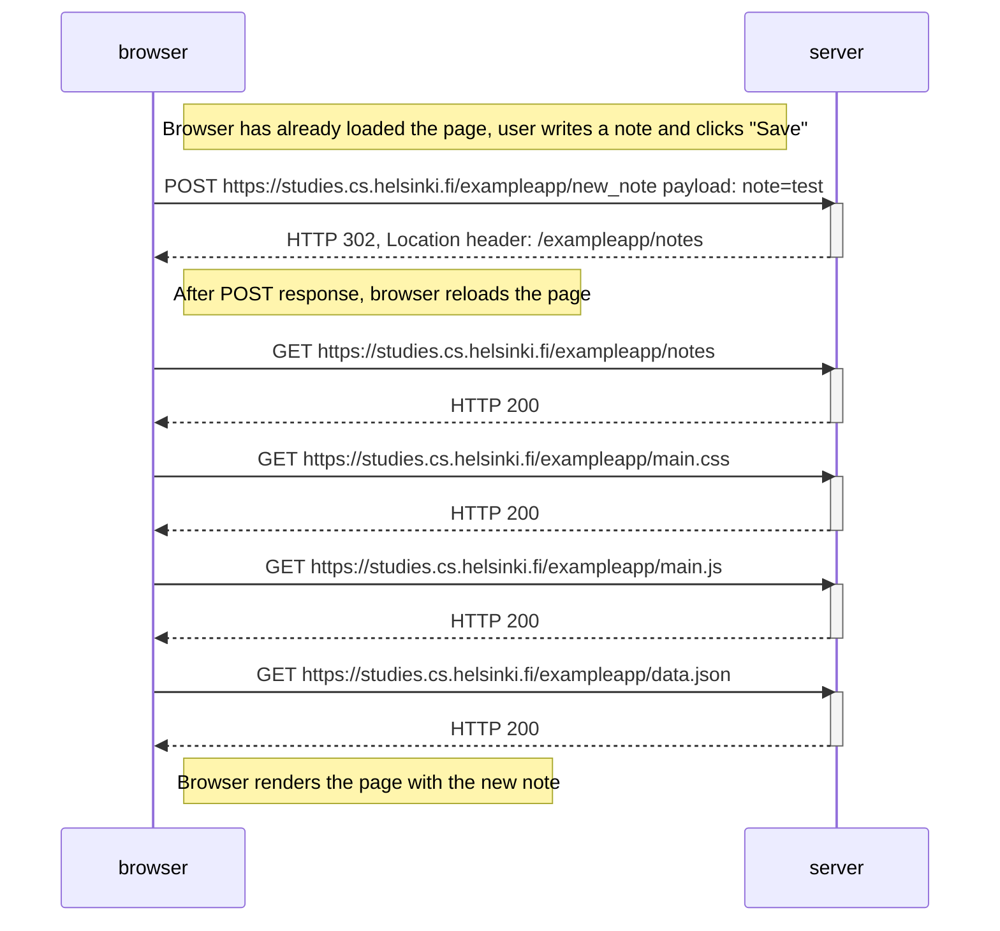

```mermaid
    sequenceDiagram
        participant browser
        participant server

        Note right of browser: Browser has already loaded the page, user writes a note and clicks "Save"

        browser->>server: POST https://studies.cs.helsinki.fi/exampleapp/new_note payload: note=test
        activate server
        server-->>browser: HTTP 302, Location header: /exampleapp/notes
        deactivate server

        Note right of browser: After POST response, browser reloads the page

        browser->>server: GET https://studies.cs.helsinki.fi/exampleapp/notes
        activate server
        server-->>browser: HTTP 200
        deactivate server

        browser->>server: GET https://studies.cs.helsinki.fi/exampleapp/main.css
        activate server
        server-->>browser: HTTP 200
        deactivate server

        browser->>server: GET https://studies.cs.helsinki.fi/exampleapp/main.js
        activate server
        server-->>browser: HTTP 200
        deactivate server

        browser->>server: GET https://studies.cs.helsinki.fi/exampleapp/data.json
        activate server
        server-->>browser: HTTP 200
        deactivate server

        Note right of browser: Browser renders the page with the new note
```

