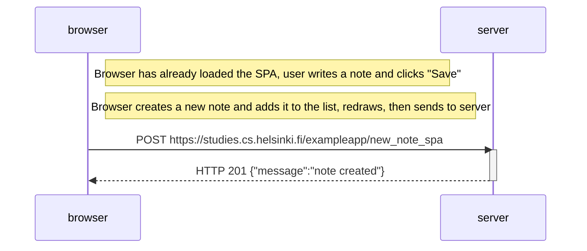

```mermaid
    sequenceDiagram
        participant browser
        participant server

        Note right of browser: Browser has already loaded the SPA, user writes a note and clicks "Save"
        Note right of browser: Browser creates a new note and adds it to the list, redraws, then sends to server
    
        browser->>server: POST https://studies.cs.helsinki.fi/exampleapp/new_note_spa
        activate server
        server-->>browser: HTTP 201 {"message":"note created"}
        deactivate server
```

